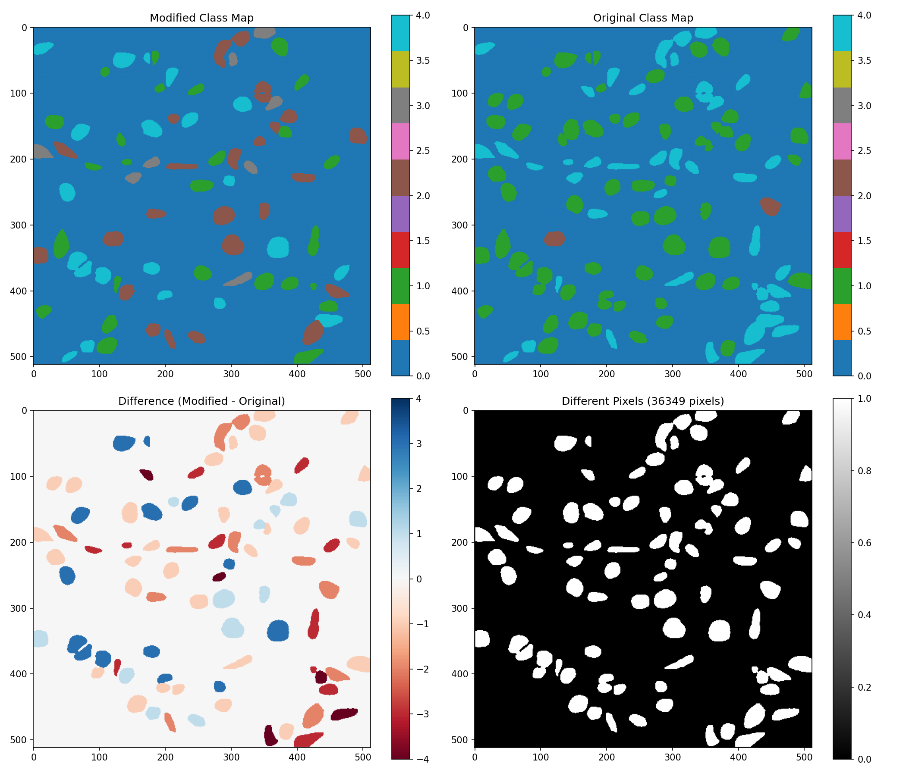
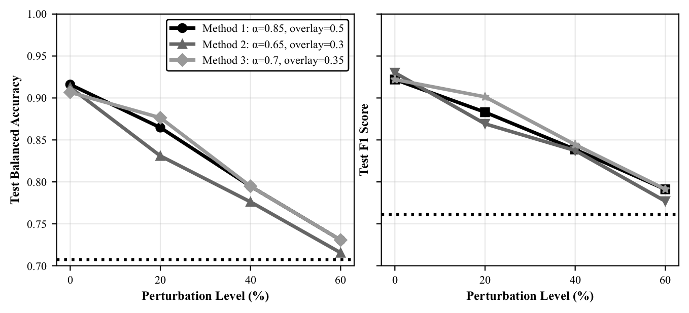

# Semantic-Guided Multimodal Preprocessing for Vision Transformer-Based CCRCC Grading

Reference implementation for the MICCAI 2026 paper of the same name.

WHO/ISUP grading of clear cell renal cell carcinoma is decided by nuclear
morphology, but the two families of automated methods that address it do not
talk to each other. Fine-grained methods classify individual nuclei accurately
and then collapse those predictions into a patch grade by max-voting, which
assigns the most abundant nuclei class and therefore systematically under-grades
any patch whose clinical significance comes from a sparse population of
high-grade nuclei. Coarse-grained methods send the RGB patch straight into a
Vision Transformer and never use the nuclei-level knowledge that pretrained
nuclei classifiers already encode. This repository implements a third option:
fuse the nuclei classification map into the RGB patch as a preprocessing step,
before the image reaches the network, so that a stock pretrained ViT can learn
the non-linear relationship between nuclear grade distribution, spatial context
and patch grade without any architectural modification. Two fusion methods are
implemented, classification map channel concatenation (HEC) and multiplicative
modulation (MM), and both are evaluated against an RGB-only baseline trained
under an identical protocol.

## Paper

Preprint: PENDING ARXIV LINK

Published version: forthcoming in the MICCAI COMPAYL++ 2026 proceedings (Springer LNCS).
Springer production runs several months behind acceptance. Once the DOI is
issued, please replace the line above with the Springer link and keep the arXiv
link as a secondary reference.

## Dataset

1000 H&E stained patches at 512x512 pixels, drawn from the TCGA Research
Network with nuclei annotations from Gao et al. [1]. Patch-level ground truth
was annotated by a single pathologist following WHO/ISUP guidelines for grades
1 to 3.

Each patch has an accompanying `.mat` file containing two arrays. `class_map`
holds a per-pixel nuclei label and `instance_map` holds a per-nucleus instance
identifier. The nuclei label space has five values: 0 background, 1 to 3 tumour
grades, and 4 for a non-tumorous cell. Value 4 is a cell-type label and is not
WHO/ISUP grade 4, which denotes sarcomatoid or rhabdoid dedifferentiation and
is excluded from this work because its nuclei no longer follow a consistent
pattern.

The class distribution is heavily skewed, which shapes several decisions
elsewhere in the codebase.

| Split | Grade 1 | Grade 2 | Grade 3 |
| --- | --- | --- | --- |
| Original dataset | 66.3% | 23.0% | 10.7% |
| Training set after augmentation | 35.7% | 35.1% | 29.2% |

Data are split 70 / 10 / 20 into train, validation and test with stratified
sampling. Augmentation is horizontal and vertical flips applied to minority
classes in the training set only. Validation and test keep the original
imbalance, so balanced accuracy measured on them still reflects real class
prevalence.

Single-pathologist annotation means inter-observer variability is not captured.
The claim being tested is the methodological advantage of semantic-guided
preprocessing, not clinical-grade ground truth.

Splits are written to disk per seed (`labels_with_splits_seed<N>.csv`) and
reused rather than recomputed, so every data form trained under the same seed
sees byte-identical split membership. Without that, the preprocessing
comparison would confound method with split.

## Method

### Backbone selection

Five pretrained ViT checkpoints were fine-tuned on RGB patches only, with no
semantic guidance, using an identical protocol. All patches were resized to
384x384. The classification head was replaced with a three-grade output layer
and all weights were updated.

| Model | F1 | Accuracy | Precision | Recall |
| --- | --- | --- | --- | --- |
| Google ViT Base Patch32-384 | 0.8095 | 0.8077 | 0.8181 | 0.8077 |
| Google ViT Large Patch32-384 | 0.8079 | 0.8076 | 0.8112 | 0.8076 |
| Google ViT Base Patch16-224 | 0.7766 | 0.7821 | 0.7846 | 0.7821 |
| Google ViT Base Patch16-224-in21k | 0.7536 | 0.7564 | 0.7546 | 0.7564 |
| OpenAI CLIP ViT Base Patch32 | 0.5454 | 0.5513 | 0.5538 | 0.5513 |

Google ViT Base Patch32-384, pretrained on ImageNet-21k, was selected for all
subsequent experiments. It tokenises the image into 32x32 pixel patches, which
captures local and global tissue context at the working resolution.

### Classification map channel concatenation (HEC)

Colour deconvolution [2] separates the H&E patch into hematoxylin (H) and
eosin (E) channels. The third channel produced by deconvolution is the cross
product of the H and E stain vectors rather than a measured stain, so it
carries no independent stain information and can be discarded. The nuclei
classification map takes its place as channel C.

Class labels are mapped linearly to the full 8-bit range (`output = class *
63.75`, giving 0, 64, 128, 192, 255). Even spacing matters here: raw labels 0
to 4 would be compressed into the bottom 2% of the channel and would not
survive the ViT input normalisation, and the ordinal distance between grades
would be lost.

Implemented in `ccrcc_grading/hec.py`.

### Multiplicative modulation (MM)

HEC fuses the two modalities but requires colour deconvolution and does not
emphasise clinically important grades. MM is a single configurable method that
leaves the original RGB image in place and modulates it by nuclei grade
importance. It has four components.

**Intensity modulation.** For each pixel,

```
I'(x, y) = I(x, y) * (1 + alpha * f(C(x, y)))
```

where `C(x, y)` is the nuclei label and `alpha > 0` controls modulation
strength. The multiplicative form is the reason the method works: it scales the
image gradient rather than replacing it, so `grad(I') = (1 + alpha * w_c) *
grad(I)`. Edge and texture information, which is what ViT attention keys on,
survives the fusion. An additive overlay would partially destroy it. As `alpha`
approaches 0 the output converges on the untouched RGB patch, which makes
`alpha` a clean ablation axis against the baseline.

**Grade-dependent weighting.** The weighting `f` is a sigmoid,

```
f(c) = exp(beta * (c - c0)) / (1 + exp(beta * (c - c0)))
```

with `beta` controlling steepness. Grading is ordinal, not categorical, so the
weight has to rise smoothly across grades rather than jump. The sigmoid applies
to tumour grades 1 to 3 with `f(3)` close to 1; background and non-tumorous
cells receive fixed weights outside it. In practice the sigmoid combines with
per-grade base weights `w_c` to give the clinical hierarchy: `w0 = w4 = 1.00`,
`w1` in 1.10 to 1.25, `w2` in 1.40 to 1.80, `w3` in 1.85 to 2.00.

**Spatial smoothing.** Gaussian smoothing with `sigma` of 1.5 to 2.0 pixels is
applied to the classification map before fusion, on the classification channel
only and never on the RGB data. Without it, nuclei boundaries become hard edges
that the ViT can latch onto as artefacts rather than as morphology.

**Colour overlay.** Optionally a perceptually optimised colour overlay is
blended in with coefficient `O` in [0, 1], giving `(1 - O) * I + O * C_color *
I`, practical range 0.2 to 0.5. Distinct hues mark each grade: green for grade
1, yellow for grade 2, red for grade 3. Intensity alone encodes grade as a
scalar that the model can confuse with staining variation; the hue adds an
explicitly categorical channel on top of the ordinal one.

Implemented in `ccrcc_grading/modulation.py`. The swept configurations are in
`ccrcc_grading/modulation_configs.py`, one entry per results-table row.


### Sensitivity analysis

Deployment would use predictions from a pretrained nuclei model, not ground
truth. Robustness to imperfect maps was measured by injecting controlled errors
into the classification maps at evaluation time only, with models trained on
ground truth, which isolates the effect of nuclei accuracy while holding RGB
constant.

Two error types are injected simultaneously. Segmentation errors nullify a
nucleus, simulating a false negative. Classification errors alter its grade with
an adjacent-grade preference, since real classifiers confuse neighbouring
grades far more often than they skip one. Errors are applied per nucleus
instance, not per pixel: a pixel-level perturbation would speckle a single
nucleus with several grades, which no classifier produces. The dominant class
within an instance is used as its current label, because the stored class map
is per pixel and can disagree at instance borders.

Implemented in `ccrcc_grading/perturbation.py`. Because the requested
percentage applies to instances rather than pixels, the two figures reported by
`scripts/inspect_perturbation.py` do not match and are not meant to.



## Results

Test set performance, sorted by balanced accuracy. Precision, recall and
accuracy are micro-averaged; F1 is macro-averaged. The Config column gives the
index into `MODULATION_CONFIGS` in `ccrcc_grading/modulation_configs.py`.

| Method | Config | alpha | beta | sigma | O | Bal. Acc. | Accuracy | Precision | Recall | F1 |
| --- | --- | --- | --- | --- | --- | --- | --- | --- | --- | --- |
| Original RGB | n/a | n/a | n/a | n/a | n/a | 0.7071 | 0.7723 | 0.7723 | 0.7723 | 0.7611 |
| HEC | n/a | n/a | n/a | n/a | n/a | 0.8612 | 0.8911 | 0.8911 | 0.8911 | 0.8859 |
| MM | 1 | 0.85 | 3.0 | 1.5 | 0.5 | **0.9160** | 0.9208 | 0.9208 | 0.9208 | 0.9220 |
| MM | 2 | 0.65 | 2.5 | 2.0 | 0.3 | 0.9125 | **0.9307** | **0.9307** | **0.9307** | **0.9301** |
| MM | 3 | 0.70 | 2.5 | 2.0 | 0.35 | 0.9067 | 0.9208 | 0.9208 | 0.9208 | 0.9219 |
| MM | 4 | 0.70 | 3.0 | 0.0 | 0.4 | 0.9009 | 0.9109 | 0.9109 | 0.9109 | 0.9129 |
| MM | 8 | 0.75 | 3.0 | 2.0 | 0.4 | 0.9009 | 0.9109 | 0.9109 | 0.9109 | 0.9129 |
| MM | 5 | 0.50 | 2.0 | 2.0 | 0.2 | 0.8822 | 0.9109 | 0.9109 | 0.9109 | 0.9103 |
| MM | 6 | 0.80 | 4.0 | 2.0 | 0 | 0.7889 | 0.8317 | 0.8317 | 0.8317 | 0.8240 |
| MM | 7 | 0.90 | 5.0 | 1.5 | 0 | 0.7703 | 0.8317 | 0.8317 | 0.8317 | 0.8195 |

Comparison against the two external reference points:

| Approach | Balanced accuracy | F1 |
| --- | --- | --- |
| Max-voting aggregation of nuclei grades [1] | 0.427 | not reported |
| RGB-only ViT baseline, identical training protocol | 0.7071 | 0.7611 |
| Best multiplicative modulation configuration | 0.9160 | 0.9220 |

Sensitivity to perturbation of the classification maps, best three
configurations, averaged over seeds 7, 12, 14 and 313. Both segmentation and
classification errors are injected simultaneously. Values below are digitized
from Fig. 3 of the paper; the 0% points differ slightly from Table 2 because
Table 2 reports a single best run rather than the seed average.



Test balanced accuracy:

| Perturbation | M1 (a=0.85, O=0.5) | M2 (a=0.65, O=0.3) | M3 (a=0.7, O=0.35) |
| --- | --- | --- | --- |
| 0% | 0.919 | 0.906 | 0.905 |
| 20% | 0.865 | 0.830 | 0.877 |
| 40% | 0.775 | 0.774 | 0.795 |
| 60% | 0.716 | 0.712 | 0.730 |

Test F1:

| Perturbation | M1 | M2 | M3 |
| --- | --- | --- | --- |
| 0% | 0.920 | 0.935 | 0.927 |
| 20% | 0.884 | 0.870 | 0.901 |
| 40% | 0.834 | 0.836 | 0.844 |
| 60% | 0.792 | 0.778 | 0.788 |

All three configurations stay above the RGB-only baseline (0.707 balanced
accuracy, 0.761 F1) through 60% combined perturbation, and degrade
monotonically rather than collapsing.

## Findings

**Multiplicative modulation beats channel concatenation, and the reason is
gradient preservation.** MM reaches 0.9160 balanced accuracy against 0.8612 for
HEC. Both fuse the same information, so the difference is in what each does to
the RGB signal. HEC destroys one third of the colour channels and requires
colour deconvolution, which is itself sensitive to stain variation. MM leaves
every RGB channel intact and scales it, so nuclear chromatin texture and
staining intensity, the features WHO/ISUP grading actually depends on, reach
the transformer unaltered while the semantic emphasis rides on top of them.

**The colour overlay, not the intensity modulation, carries the discriminative
signal.** This is the clearest ablation in the table. The two configurations
with `O = 0` fall to 0.7889 and 0.7703 balanced accuracy, barely above the
0.7071 RGB-only baseline, despite having the most aggressive modulation
strengths in the sweep (`alpha` 0.80 and 0.90, `w3` up to 2.5). Removing the
overlay leaves spatial segmentation information intact but eliminates explicit
class distinction: the model can see where the nuclei are but not what grade
they are. Intensity modulation alone is close to a general spatial attention
prior, and a general spatial attention prior is worth about 7 points here.
Explicit class marking is worth another 13.

**Stronger modulation is not better modulation.** The best configurations sit
at `alpha` 0.7 to 0.85. Lower values under-emphasise the nuclei, and higher
values over-saturate and start distorting the very texture the multiplicative
form exists to preserve. The failure mode at the weak end is instructive: a low
`alpha` of 0.3 with minimal grade weights reaches 0.680, which is *below* the
0.707 RGB-only baseline. That configuration distorts nuclei appearance without
providing enough emphasis to pay for the distortion. A method that merely
highlighted regions would degrade gracefully towards the baseline; one that
drops below it is being actively used by the model, and used badly when
mis-tuned. That is evidence the ViT is exploiting the semantic content rather
than treating the modulation as noise.

**Smoothing is close to free, which bounds how much of the gain is a boundary
artefact.** Config 4 uses `sigma = 0`, hard nuclei boundaries with no
smoothing, and still reaches 0.9009. If the model were keying on sharp
segmentation edges as an artefact, removing smoothing should have helped
substantially, and it does not. Smoothing buys about 1.5 points at the top of
the table, consistent with it doing what it was designed to do, softening
boundaries, rather than suppressing an artefact the model would otherwise
exploit.

**The 21 point gain over baseline survives realistic nuclei classifier error.**
This is the finding with the most practical weight. Current state-of-the-art
nuclei classification models reach roughly 0.64 to 0.70 balanced accuracy
[1, 3], which is a 30 to 36 percent error rate. At 30 percent injected
perturbation the fusion still holds 0.82 to 0.86, and stays above the RGB-only
baseline out to 60 percent. The method therefore does not require a nuclei
classifier better than the ones that already exist. It is deployable now,
against imperfect upstream predictions, which was the question the sensitivity
analysis was designed to answer.

**Ground-truth classification maps alone also reach 0.916, and that ceiling is
the point.** Feeding the model the class maps by themselves matches the best
fusion result, but only under perfect nuclei classification, which is
unavailable in practice. The value of fusion is not that it beats a perfect
oracle. It is that it degrades far more slowly than the oracle would, because
RGB texture provides a complementary and independent source of evidence when
the semantic channel is wrong.

**Max-voting is not a weak baseline, it is the wrong operation.** At 0.427
balanced accuracy it sits far below even RGB-only processing. The failure is
structural rather than a matter of tuning: assigning the most abundant nuclei
class necessarily under-grades any patch where a minority of high-grade nuclei
determines the clinical grade, and that pattern is common in this dataset. No
choice of aggregation threshold recovers it, because the pathologist's decision
depends jointly on presence, spatial distribution, density and morphological
context. Those are exactly the relations a transformer can learn and a voting
rule cannot express.

## Repository layout

```
ccrcc_grading/
  config.py               Paths and model name, all overridable by environment variable
  data_handler.py         Label loading, stratified seed splits, dataset and loader construction
  hec.py                  Colour deconvolution and HEC channel concatenation
  modulation.py           CCRCCPreprocessor, the multiplicative modulation methods
  modulation_configs.py   The swept configurations, one per results-table row
  perturbation.py         Instance-level error injection for the sensitivity analysis
  evaluation.py           Metrics, confusion matrices, MLflow logging
  train.py                Fine-tuning entry point and the experiment grid
scripts/
  extract_results.py      Flattens the MLflow SQLite store into a results CSV
  plot_sensitivity.py     Perturbation curves for the top three configurations
  inspect_perturbation.py Verifies a perturbed class map against its original
  backup_mlflow.py        Backup and restore for the MLflow store
figures/
```

Configuration names such as `Mix_CoEm_a085_b30_s15_o050_w100125160200100` are
generated by `generate_config_name` and encode every parameter that changes the
output pixels, including grade weights. Generated datasets are cached under
that name, so an identical configuration is never rebuilt and a changed one
never silently reuses stale images.

## Environment

Python 3.12 or later. Dependencies are declared in `pyproject.toml`:

accelerate, datasets, matplotlib, mlflow, opencv-python, pandas, pillow,
scikit-learn, scipy, seaborn, torch, torchvision, transformers.

Device selection is automatic and prefers Apple MPS, then CUDA, then CPU.
Experiment tracking uses MLflow with a SQLite backend.

All filesystem paths are read from environment variables with relative
fallbacks, so no path is hardcoded.

| Variable | Fallback | Purpose |
| --- | --- | --- |
| `CCRCC_DATA` | `./data` | Working directory for image sets, written and deleted per run |
| `CCRCC_SOURCE_DATA` | `$CCRCC_DATA/raw` | Read-only raw dataset, expects `Patches/`, `Labels/`, `Classmap/`, `HEC/` |
| `CCRCC_LOGS` | `./logs` | Checkpoints and per-run evaluation JSON |
| `CCRCC_MLRUNS` | `./mlruns` | MLflow tracking store |
| `CCRCC_MLFLOW_BACKUP` | `./mlflow_backups` | Destination for MLflow backups |
| `CCRCC_FIGURES` | `./figures` | Generated figures |
| `CCRCC_RESULTS_CSV` | `./mlflow_results.csv` | Flattened results table |
| `CCRCC_MODEL` | `google/vit-base-patch32-384` | Backbone checkpoint |

Working image sets are copied to `CCRCC_DATA` and removed after each run, so it
should point at fast local storage rather than a network mount.

## Ethics

This work uses publicly available data from the TCGA Research Network with
nuclei annotations from Gao et al. [1]. No additional ethics approval was
required.

## License

MIT. See `LICENSE`.

## References

1. Gao, Z., Shi, J., Zhang, X., Li, Y., Zhang, H., Wu, J., Wang, C., Meng, D.,
   Li, C. Nuclei grading of clear cell renal cell carcinoma in histopathological
   image by composite high-resolution network. MICCAI 2021, vol. 12908,
   pp. 132-142.
2. Ruifrok, A.C., Johnston, D.A. Quantification of histochemical staining by
   color deconvolution. Analytical and Quantitative Cytology and Histology
   23(4), 291-299 (2001).
3. Javadian, F., Aminparast, Z., Stegmaier, J., Jose, A. Comparative analysis of
   unsupervised and supervised autoencoders for nuclei classification in clear
   cell renal cell carcinoma images. IEEE ISBI 2025, pp. 1-5.
4. Warren, A.Y., Harrison, D. WHO/ISUP classification, grading and pathological
   staging of renal cell carcinoma: standards and controversies. World Journal
   of Urology 36(12), 1913-1926 (2018).
5. Delahunt, B., Eble, J.N., Egevad, L., Samaratunga, H. Grading of renal cell
   carcinoma. Histopathology 74(1), 4-17 (2019).
6. Browning, L., Colling, R., Verrill, C. WHO/ISUP grading of clear cell renal
   cell carcinoma and papillary renal cell carcinoma. Diagnostic Pathology 16,
   75 (2021).
7. Bilal, M., Jewsbury, R., Wang, R., AlGhamdi, H.M., Asif, A., Eastwood, M.,
   Rajpoot, N. An aggregation of aggregation methods in computational pathology.
   Medical Image Analysis 88, 102885 (2023).
8. Chen, R.J., Lu, M.Y., Wang, J., Williamson, D.F.K., Rodig, S.J., Lindeman,
   N.I., Mahmood, F. Pathomic fusion: an integrated framework for fusing
   histopathology and genomic features for cancer diagnosis and prognosis. IEEE
   Transactions on Medical Imaging 41(4), 757-770 (2022).
9. Le Vuong, T.T., Kim, K., Song, B., Kwak, J.T. Joint categorical and ordinal
   learning for cancer grading in pathology images. Medical Image Analysis 73,
   102206 (2021).
10. Brodersen, K.H., Ong, C.S., Stephan, K.E., Buhmann, J.M. The balanced
    accuracy and its posterior distribution. ICPR 2010, pp. 3121-3124.
11. Mou, E., Wang, H., Chen, X., Li, Z., Cao, E., Chen, Y., Huang, Z., Pang, Y.
    Retinex theory-based nonlinear luminance enhancement and denoising for
    low-light endoscopic images. BMC Medical Imaging 24(1), 207 (2024).
12. Li, X., Plataniotis, K.N. A complete color normalization approach to
    histopathology images using color cues computed from saturation-weighted
    statistics. IEEE Transactions on Biomedical Engineering 62(7), 1862-1873
    (2015).
